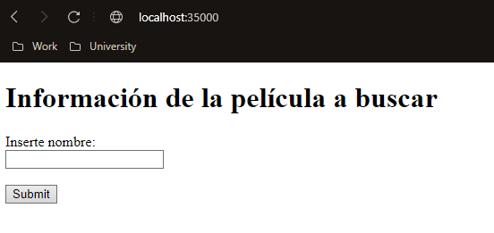
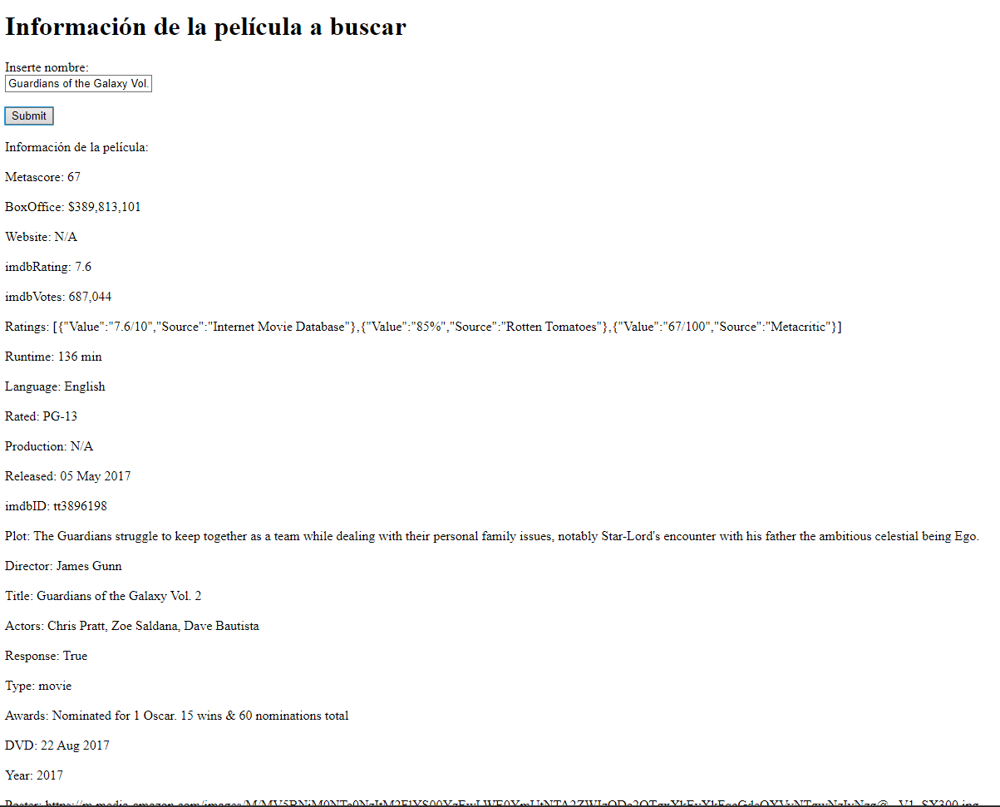

# Taller # 1
## Aplicaciones-distribuidas-http-sockets-html-js

### Nombre: David Arturo Narváez Lossa

Debe construir una aplicación para consultar la información de películas de cine.  La aplicación recibirá una frase de búsqueda del título, por ejemplo “Guardians of the galaxy”  y deberá mostrar el los datos de la película correspondiente. Para esto utilice el API gratuito de https://www.omdbapi.com/ (Puede crear obtener una llave gratuita para realizar consultas). Se le pide que su implementación sea eficiente en cuanto a recursos así que debe implementar un Caché que permita evitar hacer consultas repetidas al API externo.

### Requerimientos:

Tener instalado maven, entorno de desarrollo para el lenguaje (java) repositorio de git (https://github.com/Art2416/Aplicaciones-distribuidas-http-sockets-html-js-.git)

### Ejecución del programa

* Para ejecutar lo primero es clonar el repositorio (https://github.com/Art2416/Aplicaciones-distribuidas-http-sockets-html-js-.git). 
* Poner en ejecución el servidor web ya sea desde mvn iniciando el HttpServer.
* Ingresar desde el navegador (mozila preferiblemente).
* En la barra de búsqueda ingresar http://localhost:35000

Ejemplo de ejecución retornando la información de la API correspondiente al sitio de películas

### Información adicional

* la documentación se puede generar desde maven con su respectivo comando
* El diseño del software es extensible tanto en funcionalidades como en realizar consultas a otra API
* Emplea patrones (Singleton)
* Emplea principios (Single responsability)